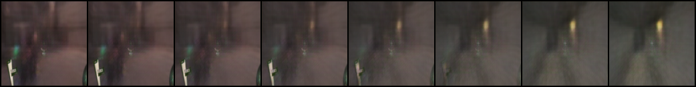
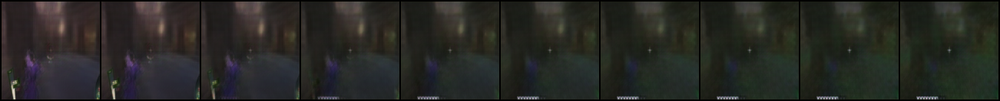
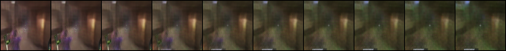
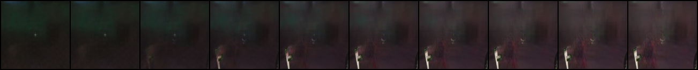
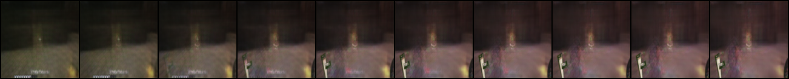
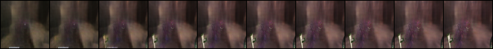
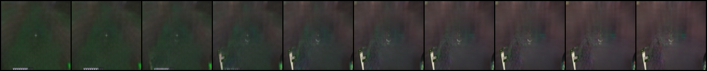

Style transfer between deadlock and minecraft screenshots using a CVAE with Multilayer perceptual loss :)

## Interpolation

## Style transfer
### Deadlock to Minecraft

### Minecraft to Deadlock

